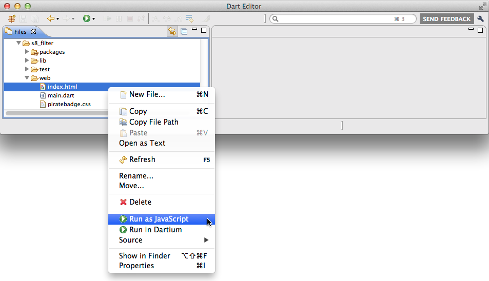

## Step 9: Run the app as JavaScript

In this step, you compile the app to JavaScript and
run it in the modern browser of your choice.

_**Keywords**: dart2js_

Once you're ready to test your app in a non-Dartium browser,
you need to compile your app to JavaScript.

### Run the app in your default browser

&rarr; In Dart Editor, right-click the HTML file and choose **Run as JavaScript**.

For example, go to **samples/s8_filter/web/index.html**,
right-click it, and choose **Run as JavaScript**.

At the lower right of Dart Editor is a progress bar
telling you the status of the build,
which might take 15 or 20 seconds.
You might also see warnings in an Output pane;
as long as your app eventually comes up,
you can ignore the warnings.

Once Dart Editor compiles your file,
it brings up the app in your default browser
(for example, Chrome).

### Run the app in another browser

Copy the app's URL from your default browser,
and paste it into another browser,
such as Safari or Firefox.

## What next?

Try the [AngularDart Tutorial](https://angulardart.org/tutorial/).

## [Home](../README.md) | [< Previous](step-8.md#step-8-use-a-filter-to-modify-data)
